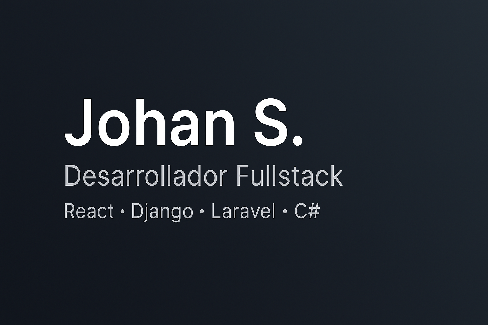

<!-- Banner -->

# 👋 Hola, soy Johan Steven  

💻 **Desarrollador Web Fullstack** | Tecnólogo en ADSO (SENA)  
🚀 Apasionado por el desarrollo web, APIs y la mejora continua  
✨ Enfocado en el **código limpio**, las buenas prácticas y la mejora constante.  

---

## 🛠️ Tecnologías principales  

### 🌐 Frontend  
  
  
  
  

### ⚙️ Backend  
  
  
  
  

### 🗄️ Bases de datos  
  
  
  

### ☁️ Cloud & Otros  
  
  
  

---

## 📌 Proyectos destacados  

### 🔹 [Gucobro](https://github.com/johanprogramador/Gucobro)  
💰 Sistema de recaudo y gestión de préstamos.  
- Backend en **PHP/Laravel**  
- Base de datos **MySQL**  
- Panel de administración para gestión de clientes y pagos  

---

### 🔹 Proyecto 2 (ejemplo: Sistema de inventario)  
📦 Aplicación para gestión de inventarios y facturación.  
- **Django + React**  
- API REST con JWT  
- Dashboard moderno con gráficos  

---

### 🔹 Proyecto 3 (ejemplo: Blog con autenticación)  
📝 Blog con roles, comentarios y panel administrativo.  
- **Laravel + Vue**  
- Sistema de login y permisos  
- Editor de artículos enriquecido  

*(Cuando tengas listos más proyectos reales, cámbialos aquí y deja solo los de calidad)*  

---

## 📊 Estadísticas  

  

  

---

## 📫 Contáctame  

- 📧 **tuemail@dominio.com**  
- 💼 [LinkedIn](https://www.linkedin.com/)  
- 📍 Tulua, valle del cauca – Colombia  

---
